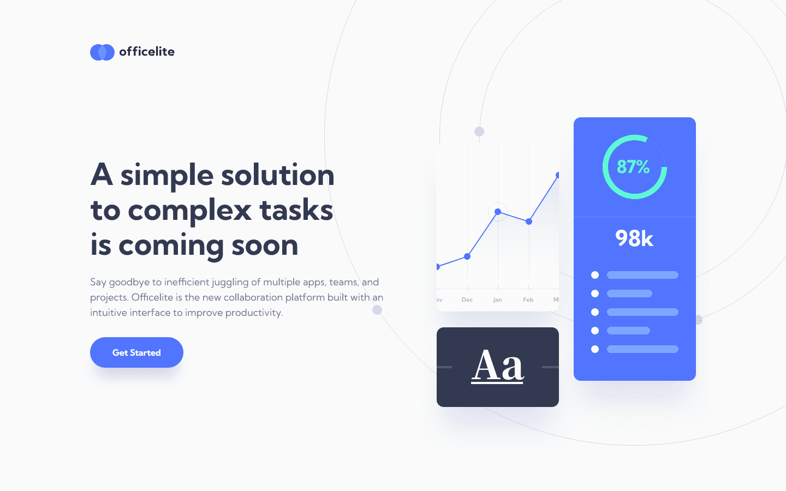
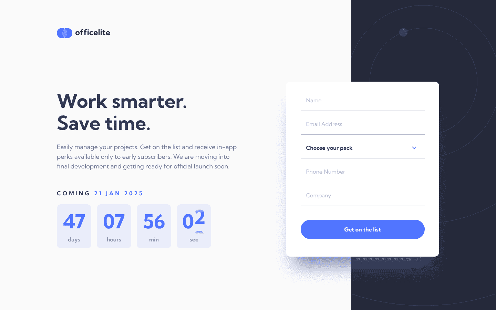

# Frontend Mentor - Officelite coming soon site solution

This is a solution to the [Officelite coming soon site challenge on Frontend Mentor](https://www.frontendmentor.io/challenges/officelite-coming-soon-site-M4DIPNz8g). Frontend Mentor challenges help you improve your coding skills by building realistic projects.

## Table of contents

- [Overview](#overview)
  - [The challenge](#the-challenge)
  - [Screenshots](#screenshots)
  - [Links](#links)
- [My process](#my-process)
  - [Built with](#built-with)
- [Author](#author)

## Overview

### The challenge

Users should be able to:

- [x] View the optimal layout for the site depending on their device's screen size
- [x] See hover states for all interactive elements on the page
- [x] See error states when the contact form is submitted if:
  - The `Name` and/or `Email Address` fields are empty
  - The `Email Address` is not formatted correctly
- [x] **Bonus**: See a live countdown timer that ticks down every second
- [x] **Bonus**: See a custom-styled `select` form control in the sign-up form

### Screenshots




### Links

- Solution URL: [Add solution URL here](https://your-solution-url.com)
- Live Site URL: https://officelite-coming-soon-site-dp1.pages.dev/

## My process

### Built with

- [React](https://reactjs.org/) 🤝 [TypeScript](https://www.typescriptlang.org/)
- [Storybook](https://storybook.js.org/) - For practicing Component Driven Development
- [NumberFlow for React](https://number-flow.barvian.me/) - Transition and format numbers
- [react-countdown](https://www.npmjs.com/package/react-countdown) - Customizable countdown component for React
- [React Aria](https://react-spectrum.adobe.com/react-aria/) - Unstyled, accessible component library
- [React Router](https://reactrouter.com/) - Client-side routing library

<!-- ### What I learned

Use this section to recap over some of your major learnings while working through this project. Writing these out and providing code samples of areas you want to highlight is a great way to reinforce your own knowledge.

To see how you can add code snippets, see below:

```html
<h1>Some HTML code I'm proud of</h1>
```
```css
.proud-of-this-css {
  color: papayawhip;
}
```
```js
const proudOfThisFunc = () => {
  console.log('🎉')
}
```

If you want more help with writing markdown, we'd recommend checking out [The Markdown Guide](https://www.markdownguide.org/) to learn more.

**Note: Delete this note and the content within this section and replace with your own learnings.**

### Continued development

Use this section to outline areas that you want to continue focusing on in future projects. These could be concepts you're still not completely comfortable with or techniques you found useful that you want to refine and perfect.

**Note: Delete this note and the content within this section and replace with your own plans for continued development.** -->

<!-- ### Useful resources

- [Example resource 1](https://www.example.com) - This helped me for XYZ reason. I really liked this pattern and will use it going forward.
- [Example resource 2](https://www.example.com) - This is an amazing article which helped me finally understand XYZ. I'd recommend it to anyone still learning this concept. -->

## Author

- Website - [Josh Javier](https://joshjavier.com/)
- Frontend Mentor - [@joshjavier](https://www.frontendmentor.io/profile/joshjavier)
- Twitter - [@joshjavierr](https://www.twitter.com/joshjavierr)
- LinkedIn - [Josh Javier](https://www.linkedin.com/in/joshjavier/)
